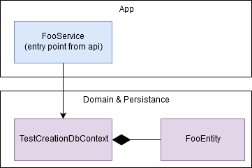

# Sample Modular Monolith application without fluff/hype(*) but with tests
- top architecture: modular monolith aka vertical slice architecture
- backend: asp.net core, entity framework core, postgresql
- tests: mstest v2, sqllite in memory, detroit school of testing
- frontend: react + typescript

## Module : UserManagement
- domain model: anemic
- architecture : layers + transaction script

#### Module architecture

## Module : TestCreation
- domain model: rich
- architecture : clean architecture + minimal CQRS

#### Module architecture

#### Domain

## Module : TestConducting
n/a

## Module : TestResults
n/a

## Working demo
n/a

(*) microservices, REST, Redux, AutoMapper, MediatR, FluentValidation, Autofac
