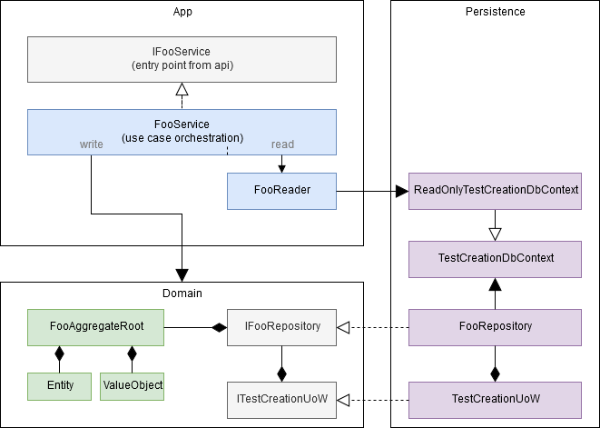

# Sample Modular Monolith application without fluff/hype(*) but with tests
- top architecture: modular monolith aka vertical slice architecture
- backend: asp.net core, entity framework core, postgresql
- tests: mstest v2, sqllite in memory, detroit school of testing
- frontend: react + typescript

## Module : Presentation.API
- integration tests for happy paths backed on sqllite in memory with the possibility to switch to postgresql if needed for debuging

#### Endpoints

| Endpoint  |  |
| ------------- | ------------- |
| /QuestionsCatalogs/  |   |
| /Questions/  | Endpoint that allows editing  whole Question aggregate (Question + Answer) as a single resource, with optimistic concurrency control |
| /TestsCatalogs/  |   |
| /Tests/  | Endpoint that allows editing only aggregate root from Test aggregate (Test + QuestionItem)  |
| /Tests/{testId}/questions/|  Endpoint that allows editing  QuestionItem entity from Test aggregate (Test + QuestionItem) as a subresource |
| /Tokens/  |   |
| /Metrics/lineprotocol/| A special endpoint available only from localhost that returns metrics (CPU usage, RAM usage, no. GC collections, GC heaps sizes, GC pause time, GC background time, ThreadpoolThreadCount, ThreadpoolQueueLength, ExceptionCount, MonitorLockContentionCount) in a format that can be directly pulled by Telegraf to InfluxDB |

#### Load testing results
- server : vps from OVH, 2 GB RAM, 1 CPU Haswell 2,4GHz, Ubuntu 18.04.3, Apache/2.4.29 as reverse proxy 

##### POST /Tokens 
A constant client count:            | 400  | 500  |  600 | 700  | 800
----------------------------------- | ---- | ---  | ---- | ---- | -----
Sync - Response Times Average (ms)  | 545  | 703  | 850  | 1021 | 1860
Sync - Req/s                        | 728  | 703  | 697  | 675  | 418
Async - Response Times Average (ms) | 651  | 802  | 947  | 1096 | 2144
Async - Req/s                       | 609  | 618  | 626  | 632  | 359

##### GET Questions/headers?catalogId=1
A constant client count:            | 400  | 500  |  600 | 700  | 800
----------------------------------- | ---- | ---  | ---- | ---- | -----
Sync - Response Times Average (ms)  | 857  | 1171 | 1375 | 1640 | 2590
Sync - Req/s                        | 455  | 423  | 428  |  421 |  300
Async - Response Times Average (ms) | 967  | 1204 | 1364 | 1633 | 2574
Async - Req/s                       | 408  | 410  | 433  |  422 |  301

##### GET Questions/5
A constant client count:            | 400  | 500  |  600 | 700  | 800
----------------------------------- | ---- | ---  | ---- | ---- | -----
Sync - Response Times Average (ms)  | 1167 | 1536 | 1802 | 2071 | 2962
Sync - Req/s                        | 339  | 321  | 331  | 328  | 261
Async - Response Times Average (ms) |   |  |  |  | 
Async - Req/s                       |   |  |  |  | 

## Module : Presentation.React
- with restrictive Content Security Policy set(no inline css or js, no eval)
- CSS Modules

## Module : UserManagement
- domain model: anemic
- architecture : layers + transaction script

#### Module architecture

## Module : TestCreation
- domain model: rich
- architecture : clean architecture + minimal CQRS
- data driven unit tests

#### Module architecture

#### Domain

## Module : TestConducting
not available yet

## Module : TestResults
not available yet

## Working demo

## ToDo
- automated tests for frontend (maybe Cypress?)
- use immerjs to create next immutable state instead of home made solution
- add sample synchronous communication beetwen UserManagement and TestCreation module

(*) microservices, REST, Redux, AutoMapper, MediatR, FluentValidation, Autofac
