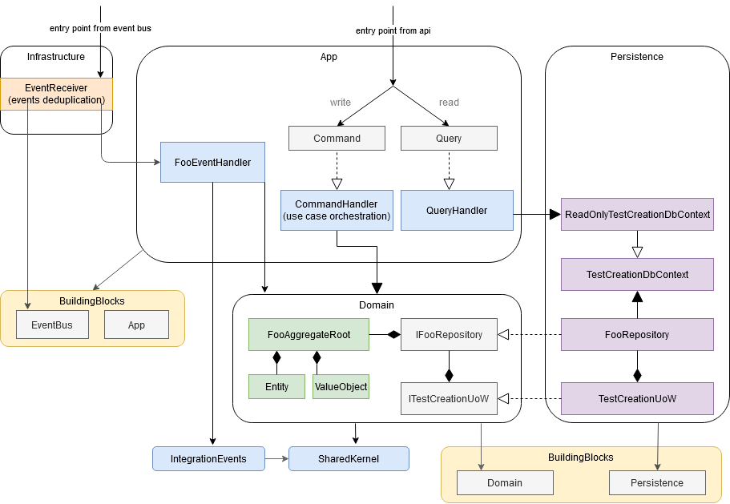
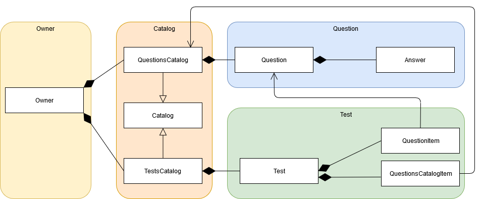

# Sample Modular Monolith application without fluff/hype(*) but with tests

1. [Overview](#Overview)
2. [Architecture decision record](#ADR)
3. [Layer : Presentation.React](#React)
4. [Layer : Presentation.API](#API)
5. [Module comparison](#ModuleComparison)
6. [Module : UserManagement](#UserManagement)
7. [Module : TestCreation](#TestCreation)
8. [Module : TestConducting](#TestConducting)
9. [Module : TestResults](#TestResults)
10. [Working demo](#DEMO)
11. [ToDo](#TODO)

##  1. Overview

- top architecture: modular monolith aka vertical slice architecture
- backend: asp.net core, entity framework core, postgresql
- tests: mstest v2, sqllite in memory, detroit school of testing 
- frontend: react + typescript
- enabled non-null reference types 

##  2. Architecture decision record

1) Use async/await or not

##  3. Layer : Presentation.React
- with restrictive Content Security Policy set(no inline css or js, no eval)
- CSS Modules

##  4. Layer : Presentation.API
- integration tests for happy paths backed on sqllite in memory with the possibility to switch to postgresql if needed for debuging

#### Endpoints

| Endpoint                  |               |
| ------------------------- | ------------- |
| /QuestionsCatalogs/       |   |
| /Questions/               | Endpoint that allows editing  whole Question aggregate (Question + Answer) as a single resource, with optimistic concurrency control |
| /TestsCatalogs/           |   |
| /Tests/                   | Endpoint that allows editing only aggregate root from Test aggregate (Test + QuestionItem)  |
| /Tests/{testId}/questions/|  Endpoint that allows editing  QuestionItem entity from Test aggregate (Test + QuestionItem) as a sub-resource |
| /Tokens/                  |   |
| /Metrics/lineprotocol/    | A special endpoint available only from localhost that returns metrics (CPU usage, RAM usage, no. GC collections, GC heaps sizes, GC pause time, GC background time, ThreadpoolThreadCount, ThreadpoolQueueLength, ExceptionCount, MonitorLockContentionCount) in a format that can be directly pulled by Telegraf to InfluxDB |
| /Users/                   |

#### Load testing results
- server : vps from OVH, 2 GB RAM, 1 CPU Haswell 2,4GHz, Ubuntu 18.04.3, Apache/2.4.29 as reverse proxy 

##### POST /Tokens 
A constant client count:            | 400  | 500  |  600 | 700  | 800
----------------------------------- | ---- | ---  | ---- | ---- | -----
Sync - Response Times Average (ms)  | 545  | 703  | 850  | 1021 | 1860
Sync - Req/s                        | 728  | 703  | 697  | 675  | 418
Async - Response Times Average (ms) | 651  | 802  | 947  | 1096 | 2144
Async - Req/s                       | 609  | 618  | 626  | 632  | 359

##### GET Questions/headers?catalogId=1
A constant client count:            | 400  | 500  |  600 | 700  | 800
----------------------------------- | ---- | ---  | ---- | ---- | -----
Sync - Response Times Average (ms)  | 857  | 1171 | 1375 | 1640 | 2590
Sync - Req/s                        | 455  | 423  | 428  |  421 |  300
Async - Response Times Average (ms) | 967  | 1204 | 1364 | 1633 | 2574
Async - Req/s                       | 408  | 410  | 433  |  422 |  301

##### GET Questions/5
A constant client count:            | 400  | 500  |  600 | 700  | 800
----------------------------------- | ---- | ---  | ---- | ---- | -----
Sync - Response Times Average (ms)  | 1167 | 1536 | 1802 | 2071 | 2962
Sync - Req/s                        | 339  | 321  | 331  | 328  | 261
Async - Response Times Average (ms) |   |  |  |  | 
Async - Req/s                       |   |  |  |  | 

##  5. Module comparison

Description                 | UserManagement                      | TestCreation
----------------------------|-------------------------------------|--------------
architecture                | layers + transaction script         | clean architecture + minimal CQRS
domain model                | anemic + a few value objects        | rich 
data access layer           | Entity Framework                    | Repository + unit of work for writes / Entity Framework for reads
exceptional situations      | DomainException                     | Result + DomainException

##  6. Module : UserManagement
- domain model: anemic
- architecture : layers + transaction script
- data driven unit tests and architectural tests
- outbox pattern for publishing integration events in a reliable way without using two phase commit - at least one delivery

#### Architecture

##  7. Module : TestCreation
- domain model: rich
- architecture : clean architecture + minimal CQRS
- data driven unit tests and architectural tests
- soft delete for all entities
- optimistic concurrency and conflic resloving for Question aggregate
- inbox pattern for receiving integration events in a reliable way without using two phase commit - deduplication of event

#### Architecture

#### Domain

##  8. Module : TestConducting
not available yet

##  9. Module : TestResults
not available yet

##  10. Working demo

##  11. ToDo
- setup development environment in docker (postgresql, TICK stack)
- automated tests for frontend (maybe Cypress?)
- use immerjs to create next immutable state instead of home made solution
- add ELK
- introduce Architecture decision record (ADR)
- finish /Tests endpoint
- add eventbus implementation backed on RabbitMQ
- deal with poisonous messages in InMemory implementation of eventbus

---

(*) Redux, AutoMapper, Autofac, MediatR, FluentValidation
